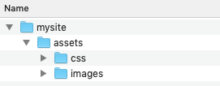

# Module 1: HTML5 and CSS

## HTML 2: Coding Introduction, software and setting up your site


# Site setup

## Introduction

- Setting up your workspace
- Getting file names right
- Signing up to GitHub


## Workspace setup

- It is crucial to get the initial setup right
- Need to be aware of folder structure 
- Helpful if you already know the page structure


                
## Folder structure
Errors in the folder structure and file names are the number 1 reason students fail the final assignment


## Folders

Create a folder for your site   
- Save everything inside that folder
- Do not move the files around - you will break the links if you do
- Put the assets (images, CSS file) in subfolders to help you organise
- All HTML files should be in the root folder

You need to use the required folder structure for your projects


## Required folder structure

Root directory is the top-level folder 
- I.e. the folder that contains any sub-folders
- All HTML files MUST be in the root directory




## Required folder structure


Inside the root directory, you will have an assets folder  
it will contain at least two extra folders:
- One for your CSS
- One for your images


## Case sensitive

The web is case sensitive

That means:

ALL folder and filenames must match
- assets/Images and assets/images are not the same

Keep **folder and filenames in lowercase** for simplicity


## File names

As before,   
Errors in the folder structure and file names are the number 1 reason students fail the final assignment

Get it right at the beginning


## File name rules

There are some rules on the web that you must follow

If you don’t, your website won’t work online

There are some exceptions, but for this project we have certain requirements, make sure you know what they are...


## Rule 1: lowercase

1. All filenames must be in lowercase
One the Web, mypage.html is different to Mypage.html 


## Rule 2: no spaces

2. There cannot be any spaces in filenames (or folders)
If the filename was my page.html and in the code you linked to the file as mypage.html it would not load


## Rule 3: default naming

3. The homepage must be called index.html
Regardless of what you want to call the first page of your website, the filename must be index.html <br>Not: homepage.html, default.html or anything else 


## Rules

1. All filenames must be in lowercase
2. There cannot be any spaces in filenames (or folders)
3. The homepage must be called index.html


## File location

HTML files must be in the root folder

- CSS file to go in assets > css
- All images in assets > images

This might seem overly specific now, but small mistakes at this stage can cause huge issues later. 


# GitHub


## GitHub

We will use GitHub as a code repository

Please signup to GitHub (it's free): [github.com](http://github.com)


## Coding Software


## Introduction

Will briefly discuss various coding tools and their pros and cons


## A note about editors

HTML and CSS are just plain text

That means:  
- You can open the files in any text editor 
- There are no compatibility issues between programs
- You **do not** need to pay for a program


## Many Options

There are many, many different tools available

All have different strengths and weaknesses

No need to pay - the free tools are often better

We will discuss:  
- Dreamweaver, Coda, Brackets, Sublime and Notepad


## Features you want

- Code hinting
- Colour coding
- Auto completion


## Dreamweaver
**Pros**
- Lots of features
- Colour coding and autocompletion

**Cons**
- Paid and only available as part of Adobe CC 
- Tendency for students to get stuck using ‘design’ mode rather than ‘code’ view


## Coda
**Pros**
- Lots of features
- Built in browser
- Colour coding/autocompletion
- Built in FTP for uploading to web


**Cons**
- Costs ~ $100 usd
- Mac only


## Sublime
**Pros**
- Free
- Super fast

**Cons**
- Mac only
- Overly simpilistic for first-time coders


## Notepad (PC)/ TextEdit (Mac)

**Pros**
- Free
- Plain text editors 

**Cons**
- No colour coding or autocompletion = increases chance of mistakes in code


## [Brackets](http://brackets.io)

**Pros**
- Free
- Great extensions
- Super fast

**Cons**
- ?


## What should I use?

Good question!

We will use Brackets in the workshops 

You can use whatever you like, but, be careful:  
- if it generates code for you = fail


## Coding introduction


## Introduction

Describe some key coding terms 

Outline the default HTML structure and describe how it works


## Key terms 

- Elements
- Tags
- Attributes


## Key terms: elements

- Define the structure and content of objects within a page
- We want to write semantic HTML 
- Using the most appropriate element for the content 
- E.g. headings, paragraphs, nav, footer, aside


## Key terms: tags

- An element name surrounded by the less-than and greater-than angled brackets
- Most commonly occur in pairs
- They open and close
- Opens like: `<div>`
- Closes like: `</div>`
- What falls between is the content of a tag:

```
<div>............</div>
```


## Key terms: attributes

Attributes are used inside a tag and provide further information about that element

Can only be in the opening tag:  

```
<div class="...">....</div>
```

Must follow the same format:  
attribute name</p>
equals sign</p>
quoted attribute value</p>


## Key terms: attributes

For example:

```
<a href=”http://google.com”>Google</a>
```

or

```
<div id="col">....</div>
```

or 

```
<header><h1 class="main">Site title</h1></header>
```


## Lowercase

- Keep your code in lowercase!


## Those terms again

**Elements**  
The named description of the content

**Tags**  
Element name wrapped in `<` and `>`

**Attributes**  
Provide additional information about an element


## HTML structure

- All HTML documents have the same structure
- It is very specific
- If you put code in the wrong spot then you will have major issues when you validate the code later


## HTML structure
Here is the basic html5 document structure:

```
<!DOCTYPE html>
<html lang="en">
    <head>
        <title></title>
        <meta charset="utf-8">
    </head>
    <body>

    </body>
</html>
```

Let's break it down!


## HTML structure

```
<!DOCTYPE html>
```

The first line of every document must declare what version of HTML you are writing

This is known as the doctype declaration 

In HTML5 it is super short and easy to remember, previously it was much longer


## HTML structure

```
<html>


</html>
```
Following the doctype, the HTML element is declared

It signifies the start of the document

Don’t forget to close it though, it also signifies the end of the document


## HTML structure

```
<head>
    <title></title>
</head>

```
The content within the `<head>` does not actually appear on the page 

This is where you set the title that appears in the browser

Also where you will add the link to your CSS documents later

Don’t forget to close the tag! 


## HTML structure

```
<body>
    <p>Content would go here</p>
</body>
```
All the visible content on the page must go between the `<body>` tags

That means all text, images and layout tags 


## Super simple page

A very simple page would look like this:


```
<!DOCTYPE html>
<html lang="en">
    <head>
        <title>My first web page</title>
        <meta charset="utf-8">
    </head>
    <body>
        <h1>Hello World.</h1>
        <p>This is a basic web page.</p>
    </body>
</html>
```

[See page here](code/basic-html.html).

