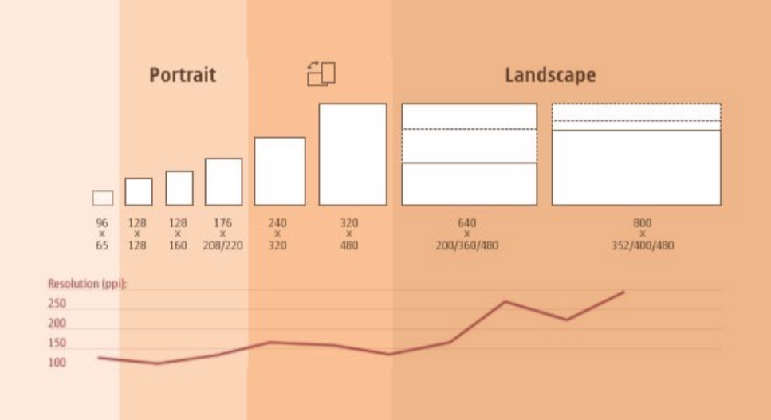

# Theories and Concepts

## Introduction
This page will provide some context about where responnsive web design emerged from before looking at the key theories and concepts in a bit more detail. 

*   Describe syntax of media queries

*   Discuss how to design for multiple devices

*   Discuss Frameworks: 

*   [CSS grids](https://alistapart.com/article/the-story-of-css-grid-from-its-creators)
Bootstrap etc

Additional readings and resources will be posted here and on Canvas.

## Readings
*   Ethan Marcotte’s [Responsive web design (the short version)](http://alistapart.com/article/responsive-web-design)
*   [Smashing Magazine’s breakdown](https://www.smashingmagazine.com/2011/01/guidelines-for-responsive-web- design/)
*   [A deeper look into Semantic Mark-up](http://www.html5rocks.com/en/mobile/responsivedesign/)
*   [This handy site](http://appvswebsite.com/)

# Some context

Where does responsive web design emerge from?

## Bandaid #1: The mobile site

How many times have you seen this?

`http://mobile.website.com...`

This was the bandaid of choice 5 years ago, with hundreds of thousands of companies being sold a mobile-specific version of their site.
*   Delivers different content
*   Delivers mobile content to desktop users
*   Doesn’t cater for new tech
*   Automates nasty redirects
*   Often hard to find original site

## Bandaid #2: The classic trio 
Trying to cater to a set range of specific device types & sizes: 

**Mobile / Tablet / Desktop**
 
## Bandaid #3: The App
*   Even now, companies are being sold mobile apps as a solution to their responsive woes.
*   An App is a tool that makes use of native device features such as location based services, notifications, or * sensors such as camera, microphone and accelerometer.
*   An app is not the answer to viewing websites on your mobile device.

## The solution
There is no way to cater for every possible screen size, unless we build designs that can respond to whatever device they’re used with.

Smart TVs? Game Consoles? Watches? New smart phones?

With the huge surge in device styles, sizes and types, we cannot design for everything.

What new inventions are coming in the next 5 years?

## Make it flexible!
Responsive Web design is the approach that suggests that design and development should:

*   respond to the user’s behaviour and environment
*   based on screen size, platform and orientation

Uses a mix of flexible grids and layouts, images and CSS media queries.

# Theories and concepts

## Mobile first design
The first mention of mobile-specific design was by Luke Wroblewski in late 2009. In a short blog post he stated:

> So when a team designs mobile first, the end result is an experience focused on the key tasks users want to accomplish without the extraneous detours and general interface debris that litter today's desktop-accessed Web sites. That's good user experience and good for business. 

[Mobile First](https://www.lukew.com/ff/entry.asp?933) by Luke Wroblewski (2009). 

You've probably seen this around, primarily the argument is that most users interact with a site through their nobile, so when you are designing a site from scratch, you should start with the mobile version and then scale up. 

## Responsive Web Design 
The term 'Responsive Web Design' was coined by Ethan Marcotte in May 2010. Expanding on Wrobkewski's idea of mobile first deisgn, he writes that:

> Working on the web, however, is a wholly different matter. Our work is defined by its transience, often refined or replaced within a year or two. Inconsistent window widths, screen resolutions, user preferences, and our users’ installed fonts are but a few of the intangibles we negotiate when we publish our work, and over the years, we’ve become incredibly adept at doing so.

> But the landscape is shifting, perhaps more quickly than we might like. Mobile browsing is expected to outpace desktop-based access within three to five years. Two of the three dominant video game consoles have web browsers (and one of them is quite excellent). We’re designing for mice and keyboards, for T9 keypads, for handheld game controllers, for touch interfaces. In short, we’re faced with a greater number of devices, input modes, and browsers than ever before.

And later: 

> Rather than tailoring disconnected designs to each of an ever-increasing number of web devices, we can treat them as facets of the same experience.  

You should read the rest of the post on [A List Apart](https://alistapart.com/article/responsive-web-design/). 

Essentially, the argument is that a Web site should respond to the needs of the user, regardless of the device they are using to access it. It seems obvious now, but it wasn't always this way. 

For more context, read the Wikipedia page entry: [Responve Web Design](https://en.wikipedia.org/wiki/Responsive_web_design) which provides a wealth of additional resources. 

### Other theories and concepts
As you might have started to realise, when it comes to web design and development, there are a lot of different theories and concepts that emerge and then disappear as new ones increase in popularity. Other concepts you might see include:

#### Graceful degradation
The idea here is that a designer would create a web page using the latest tools and technology available to them, but the site would still remain usable/presentable even if the user didn't have those tools or technology installed. You might have seen this with old Flash-based video sites, you could still access the website, but you'd get a notice advising you to install the latest version of Flash player so that you could use the site in the way the designer anticipated. 

#### Progressive enhancement
This concept dates back to 2003. The W3C explains it as:
> You start by establishing a basic level of user experience that all browsers will be able to provide when rendering your web site, but you also build in more advanced functionality that will automatically be available to browsers that can use it.

There is a great comparison of the two from the W3C here: [Graceful degradation versus progressive enhancement](https://www.w3.org/wiki/Graceful_degradation_versus_progressive_enhancement)
    
#### Flexible design
This concept predates responsive web design, but could certinaly be considered as an early push in the right direction. It was first published in a book by Zoe Gillenwater, (2008), availabe in the [UC library](https://library.canberra.edu.au/discovery/fulldisplay?docid=alma991001760009703996&context=L&vid=61ARL_CNB:61ARL_CNB&search_scope=MyInst_and_CI&tab=Everything&lang=en) and [online](http://www.flexiblewebbook.com).  The aim here is to consider how to build CSS layouts which respond to different screen sizes - on a desktop computer. It was targeted at designers who has always worked with print-based grid layouts and needed to reconsider how they could be used online. 

#### ‘Journey driven design'
A new theory to combat the popularity of _mobile-first design_. The argument here is that, yes, a lot of people do interact with the site on mobile - but they supplment their browsing with both desktop and tablet devices. So, in turn, we should think about the entire journey a user undertakes. Read more from Smashing Magazine [here](https://www.smashingmagazine.com/2017/02/mobile-first-is-just-not-good-enough-meet-journey-driven-design/).

# The future...
*   Does responsive website design end when you make a website that fluidly adapts it layout to different browser sizes?
*   What about delivering the right content?
*   Should a mobile device on data receive the same images as a desktop on broadband?
*   What about changing the context?
*   Do websites just resize all the way down for watches, and up for giant screens? 
*   Do they actually begin adapting to the context they're accessed in?
*   New technology and devices?

We can’t begin to imagine what the next big tech is going to be. 

But we already know there are a few new ones that no one seems to know what to do with: smart homes, wearable tech, virtual reality.

All of these utilise web technology as the underlying means of access - despite what they look like. We need to know how we can design for these varied interfaces. That's where the real power of responsive web design emerged. 

## What does all this mean though?

As you would have discovered in the [Marcotte](https://alistapart.com/article/responsive-web-design/) article, you'll write media queries in your css that allow you to target different device sizes. 

# Where to start?

Before we move onto the code, let us consider a few extra important things. 

## The content 
**No amount of design or code can adequately fix content problems.**

Separate content and hierarchy from any single layout possibility, and work out what components & content your site needs.

### The importance of semantic HTML
Remember how we talked about the value of semantic markup in the first 2 assignments?

Semantic markup is HTML that clearly defines the content `<article>` `<form>` `<table>` `<section>` `<figure>` `<video>`

Non-semantic mark-up tells us nothing about the content `
` ``

Semantic markup is extremely portable, and ensures websites are ready to adapt to new contexts. 

It is crucial that you use semantic markup when creating your websites. 

## The Design

Where should you start?
*   Use visual designs (pen/paper, Photoshop or similar) for quick layout exploration and asset creation
*   It’s impossible to accurately assess a responsive layout in .JPG form
*   a single Photoshop composition will only express a sliver of the layout potential a fully-flexible responsive site has...

**Don't waste your time in Photoshop** 

I'm a strong believer of using the _sketching in code_ methodology. This approach encourages rapid prototyping, directly with code. Read David Verba's [Sketching in Code: the Magic of Prototyping
](https://alistapart.com/article/sketchingincode) article from 2008 or Jared M. Spool's reflection [here](https://articles.uie.com/sketching_in_code/).

## Mockups & wireframes

*   What a .PSD file can’t easily show in terms of layout, you can communicate on a scrap of paper using a pencil
*   Wireframes can be as simple or as complex as you need them to be
*   Use Photoshop to establish the “look & feel” of a digital design; use wireframes to map out how they work, interact and respond to different conditions
*   There are thousands of tools out there; it doesn’t matter what you use.

Next, read part 2: [The code](responsive-2.md) to get started with writing media queries. 
