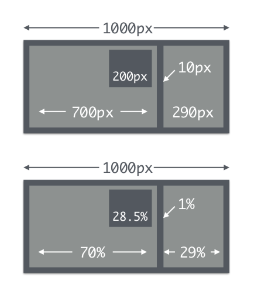

# The Code

Media queries allow you to break off specific styles for specific browser types and sizes.

## Meet Media Queries
Media Queries allow us to build on a flexible framework, and customise styles for different screen types and sizes.

```
@media screen and (max-device-width: 480px) {
    .column {
       float: none;
    } 
}
```
The query contains two components:
A. a media type (`screen`), and
B. the actual query enclosed within parentheses, containing a particular media feature (`max-device-width`) to inspect, followed by the target value (`480px`).

<hr>


## Core ingredients
So what does it take to create a responsive design? 

Speaking purely in terms of front-end layout, it takes three core ingredients:

*   Flexible grids & measurements
*   Flexible images & media
*   Media queries


## Use flexible everything
*   Start with a flexible grid
*   Use relative units (`rem`, `em`, etc) Make your images flexible
*   Make your code simple & robust

### Mobile first?
Consider mobile first. 
That doesn’t mean you need to code that way.

*   You may choose to begin with wide views in order to get a handle on a more complex layout
*   It can be easier to ensure columns and spacing are working on the wider views before working down to a single column
*   Either way, ensure you considered responsive optimisation when you planned your content; screen sizes, connection speeds, device capabilities, fat fingers vs mouse pointers, hover states etc will all affect your coding.

<hr>
# Let's get into it

## Relative units & Flexible Typesetting
*   `Em`
*   `Rem`
*   `Vw`, `vh` & `vmin`

### Em

`1em` = `16px` in most browsers

You can set the document Root to `16px` using CSS resets or by styling the body

To convert your design’s font-size to `em`, divide the desired target `font-size` (e.g. `24px`) by the container `font-size` (e.g. `16px`).

```
target ÷ context = result
24 ÷ 16 = 1.5
font-size: 1.5em;
```
### Em’s are inherited

Whenever you set an em-based `font-size` on any container, you now need to calculate any nested font sizes based on that new `font-size`!

Let’s imagine a new target `font-size` of `11px`:

```
11 ÷ 24 = 0.45833333333333em
font-size: 0.45833333333333em
```

Don’t round that number if you’re trying to stay true to a design! `0.46em` might be neater, but proportionately it wont match.


### Rem
A relative unit, like `em`

But it is always relative to the "root" element rather than using the inherited cascade like em does
This vastly simplifies working with relative units!

One great technique:
**`Px`** at the Root, **`Rem`** for Components, **`Em`** for Text Elements

### Vw, vh & vmin
CSS3 has some new values for sizing things relative to the current viewport size.

`1vw` = `1%` of viewport width  
`1vh` = `1%` of viewport height  
`1vmin` = `1vw` or `1vh`, whichever is smaller  
`1vmax` = `1vw` or `1vh`, whichever is larger  
If the viewport is 40cm wide, `1vw` = 0.4cm  

## Flexible Grids
How to get started with flexible grids?  
We can re-use the same formula that let us calculate ems!

From pixels to percentages

_target ÷ context = result_



`700 ÷ 1000 = 0.7 = 70%`  
`290 ÷ 1000 = 0.3 = 29%`  
`200 ÷ 700 = 0.285 = 28.5%`  

## Media queries

As above (so you don't forget):

```
@media screen and (max-device-width: 480px) {
    .column {
       float: none;
    } 
}
```
The query contains two components:
A. a media type (`screen`), and
B. the actual query enclosed within parentheses, containing a particular media feature (`max-device-width`) to inspect, followed by the target value (`480px`).

### Extra reading
*   Read more about [Media Queries](https://css-tricks.com/snippets/css/media-queries-for-standard-devices/)! Media Queries are the kings of Responsive Web Design.
*   Specific ways to write [fancy logic-based media queries](https://css-tricks.com/logic-in-media-queries/) based on different browser types, sizes, etc.
*   

## Media Queries & Breakpoints
*   We used to add media queries for the most popular mobile pixel dimensions. The explosion of new tablets, smartphones & touch devices means that we don’t have a preset list of dimensions anymore!
*   It’s become standard to let media queried breakpoints be defined by content/layout rather than any specific device
*   Whenever things don’t fit or hierarchy breaks, add a media query
*   I use min or max-width most often: this is a good way to keep your queries simple

You can read about why [basing your media queries on specific device sizes is doomed to failure](https://responsivedesign.is/articles/why-you-dont-need-device-specific-breakpoints). 

### Extra reading
* [Defining breakpoints](https://responsivedesign.is/strategy/page-layout/defining-breakpoints/)
* [CSS Tricks: Specificity ](https://css-tricks.com/specifics-on-css-specificity/)


## Grid Systems & Frameworks

**Can you use Bootstrap? (Or similar)**
If you feel that you’re an advanced enough coder to properly utilise pre-built frameworks, I’m happy for you to use them.

However we will specifically be looking out for tell-tale signs that you let the framework “carry” your design!

Avoid counting on your framework to design your website. Don’t let it determine your layout.

## CSS Grid Layout

You can use CSS grids to create complex responsive layouts whilst still ensuring the underlying page structure remains structured. Support was first added to Chrome, Firefox and Safari in March 2017. 

> Grid Layout lets us properly separate the order of elements in the source from their visual presentation. As a designer this means you are free to change the location of page elements as is best for your layout at different breakpoints and not need to compromise a sensible structured document for your responsive design.

*   CSS Tricks has a great [guide to CSS Grid Layout](https://css-tricks.com/snippets/css/complete-guide-grid/)
*   [Realizing common layouts using CSS Grid Layout](https://developer.mozilla.org/en-US/docs/Web/CSS/CSS_Grid_Layout/Realizing_common_layouts_using_CSS_Grid_Layout) from Mozilla MDN


## Flex-box

> The Flexbox Layout (Flexible Box) module (a W3C Candidate Recommendation as of October 2017) aims at providing a more efficient way to lay out, align and distribute space among items in a container, even when their size is unknown and/or dynamic (thus the word "flex").

Read the CSS Tricks [Complete Guide to Flexbox](https://css-tricks.com/snippets/css/a-guide-to-flexbox/) for a very detailed introduction.

### Grid or Flexbox

You'll find lots of information online about this topic, but worth reading this great summary:

>Flexbox is for one-dimensional layouts - anything that needs to be
laid out in a straight line (or in a broken line, which would be a
single straight line if they were joined back together).  
Grid is for two-dimensional layouts.  It can be used as a low-powered
flexbox substitute (we're trying to make sure that a single-column/row
grid acts very similar to a flexbox), but that's not using its full
power.  
Flexbox is appropriate for many layouts, and a lot of "page component"
elements, as most of them are fundamentally linear.  Grid is
appropriate for overall page layout, and for complicated page
components which aren't linear in their design.  
The two can be composed arbitrarily, so once they're both widely
supported, I believe most pages will be composed of an outer grid for
the overall layout, a mix of nested flexboxes and grid for the
components of the page, and finally block/inline/table layout at the
"leaves" of the page, where the text and content live.

[CSS-grid-layout - Relationship with Flexbox](http://lists.w3.org/Archives/Public/www-style/2013May/0114.html)

## Flexible images

An image with a specific size can be the bane of your existence when you’re trying to build a responsive website.

While there are many different advanced solutions, there is usually one very basic fix:

```
    img { 
        max-width: 100%; 
        height: auto;
    }
```
This forces any image to adjust to the container width.


<hr>

## Readings
*   Trent Walton’s blog (anything!): [Fit to scale](http://trentwalton.com/2011/05/10/fit-to-scale/); [Fluid type](http://trentwalton.com/2012/06/19/fluid-type/); [Flexible foundations](http://trentwalton.com/2013/01/07/flexible-foundations/)
*   [Examples of great responsive designs](http://mediaqueri.es/)
*   [A minimal, free, wire framing tool](https://wireframe.cc/)
*   [CSS Tricks on relative units of measurement & how to use them](https://css-tricks.com/rems-ems/)


